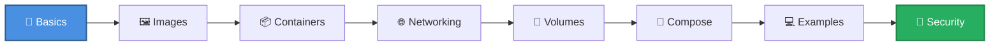

<div align="center">

# 🐳 Docker Learning & Reference Guide

### *Your Complete Journey from Beginner to Docker Expert*

[](https://www.docker.com/)
[](https://docs.docker.com/compose/)
[](LICENSE)

**A comprehensive, well-organized collection of Docker documentation, real-world examples, and best practices!**

[Getting Started](#-getting-started) • [Documentation](#-documentation-structure) • [Examples](#-examples) • [Cheatsheet](#-quick-reference)

---

</div>

## 🎯 What's Inside?

This repository is your **one-stop resource** for learning Docker, from basic concepts to advanced security patterns. Everything is organized, beginner-friendly, and production-ready!

```
📦 Complete Docker mastery in one place
├─ 📚 Comprehensive documentation
├─ 💻 Real-world examples  
├─ 🔒 Security best practices
├─ 🧪 Hands-on testing guides
└─ ⚡ Quick reference sheets
```

<br>

## 📚 Documentation Structure

<table>
<tr>
<td width="50%">

### 🎓 **Core Concepts**

<details>
<summary><b>📘 Basics</b> - Docker Fundamentals</summary>
<br>
Learn the foundations of Docker:

- What is Docker?
- Core components (Engine, Images, Containers)
- Docker architecture
- Installation & setup
- Basic workflow

👉 [Start Learning](./basics/)
</details>

<details>
<summary><b>🖼️ Images</b> - Building & Managing Images</summary>
<br>

- Dockerfile creation
- Multi-stage builds
- Image optimization
- Best practices
- Layer caching

👉 [Explore Images](./images/)
</details>

<details>
<summary><b>📦 Containers</b> - Container Lifecycle</summary>
<br>

- Running containers
- Container management
- Resource limits
- Health checks
- Logging & monitoring

👉 [Master Containers](./containers/)
</details>

<details>
<summary><b>💾 Volumes</b> - Data Persistence</summary>
<br>

- Volume types
- Data management
- Backup & restore
- Bind mounts
- Volume drivers

👉 [Understand Storage](./volumes/)
</details>

</td>
<td width="50%">

### 🚀 **Advanced Topics**

<details>
<summary><b>🌐 Networking</b> - Container Communication</summary>
<br>

- Network types (bridge, host, overlay)
- DNS resolution
- Network isolation
- Port mapping
- Custom networks

👉 [Learn Networking](./networking/)
</details>

<details>
<summary><b>🎼 Compose</b> - Multi-Container Apps</summary>
<br>

- Docker Compose basics
- Service orchestration
- YAML configuration
- Environment management
- Scaling services

👉 [Use Compose](./compose/)
</details>

<details>
<summary><b>🔐 Security</b> - Hardening Docker</summary>
<br>

- Image scanning
- Secrets management
- Network security
- User permissions
- Security best practices

👉 [Secure Docker](./security/)
</details>

<details>
<summary><b>🔧 Troubleshooting</b> - Problem Solving</summary>
<br>

- Common issues
- Debugging techniques
- Log analysis
- Performance optimization
- Quick fixes

👉 [Fix Issues](./troubleshooting/)
</details>

</td>
</tr>
</table>

<br>

## 💡 Examples

<div align="center">

### 🎨 Real-World Application Examples

</div>

| Example | Description | Technologies | Features |
|---------|-------------|--------------|----------|
| 🟢 **[Node.js API](./examples/nodejs-api/)** | REST API with PostgreSQL | Node.js, Express, PostgreSQL | Health checks, multi-stage builds |
| 🐍 **[Python Flask](./examples/python-flask/)** | Flask app with Redis cache | Python, Flask, Redis | Caching, gunicorn server |
| ⚛️ **[React App](./examples/react-app/)** | Production React build | React, Nginx | Optimized builds, nginx config |
| 🔥 **[MERN Stack](./examples/mern-stack/)** | Complete full-stack app | MongoDB, Express, React, Node | Full architecture example |
| 🔒 **[Network Isolation](./examples/network-isolation-example/)** | **⭐ Featured** - Security patterns | Multi-tier architecture | Network isolation, secrets management |

<br>

## 🌟 Featured: Network Isolation + Secrets Example

Our **most comprehensive example** demonstrating production-grade security:

```
🏗️ 3-Tier Architecture with Security Layers

Internet → Nginx (Public) → Frontend → API → Database (Isolated)
           ↓                  ↓         ↓          ↓
      frontend-net      backend-net   database-net  
                                       (internal: true 🔒)
                                       
✨ Features:
• Network isolation between tiers
• Docker secrets for credentials  
• Read-only filesystems
• Health checks
• Complete testing guide
```

👉 **[Explore Full Example](./examples/network-isolation-example/)**

<br>

## 🚀 Getting Started

### Prerequisites

```bash
# Check if Docker is installed
docker --version

# Check Docker Compose
docker compose version
```

### Quick Start Path



### Learning Path

<table>
<tr>
<td width="33%">

#### 🌱 **Beginner**
1. Read [Basics](./basics/)
2. Build first image
3. Run containers
4. Try simple [examples](./examples/)

</td>
<td width="33%">

#### 🌿 **Intermediate**
1. Learn [Networking](./networking/)
2. Master [Volumes](./volumes/)
3. Use [Docker Compose](./compose/)
4. Explore [MERN Stack](./examples/mern-stack/)

</td>
<td width="33%">

#### 🌳 **Advanced**
1. Study [Security](./security/)
2. Network isolation patterns
3. Secrets management
4. Production deployments

</td>
</tr>
</table>

<br>

## ⚡ Quick Reference

### 🔥 Most Used Commands

```bash
# Container lifecycle
docker run -d --name myapp nginx        # Run container
docker ps                                # List running containers
docker stop myapp                        # Stop container
docker rm myapp                          # Remove container

# Images
docker build -t myapp:1.0 .             # Build image
docker images                            # List images
docker pull nginx                        # Pull image

# Docker Compose
docker compose up -d                     # Start services
docker compose down                      # Stop services
docker compose logs -f                   # View logs

# Networks & Volumes
docker network ls                        # List networks
docker volume ls                         # List volumes
```

👉 **[Full Cheatsheet](./cheatsheet/)** - Complete command reference

<br>

## 📖 Additional Topics

<div align="center">

| Topic | Description | Link |
|-------|-------------|------|
| 📝 **YAML Guide** | Learn YAML for Docker Compose | [YAML Basics](./YAML/) |
| 🔐 **Secrets vs Env** | Understand the difference | [Comparison Guide](./examples/network-isolation-example/SECRETS_VS_ENV.md) |
| 🔒 **Internal Networks** | Network isolation explained | [Internal Networks](./examples/network-isolation-example/INTERNAL_NETWORK.md) |
| 🧪 **Testing Guide** | Hands-on testing examples | [Testing](./examples/network-isolation-example/TESTING.md) |

</div>

<br>

## 🎯 Repository Highlights

<div align="center">

| Feature | Description |
|---------|-------------|
| 📚 **Comprehensive** | Everything from basics to advanced security |
| 🎓 **Beginner-Friendly** | Clear explanations with real-world analogies |
| 💻 **Production-Ready** | Examples you can actually use in production |
| 🔒 **Security-Focused** | Best practices for secure deployments |
| 🧪 **Hands-On** | Testing guides and interactive examples |
| ⚡ **Quick Reference** | Cheatsheets for fast lookups |

</div>

<br>

## 📚 External Resources

<div align="center">

[](https://docs.docker.com/)
[](https://hub.docker.com/)
[](https://docs.docker.com/compose/)

</div>

- 📘 [Official Docker Documentation](https://docs.docker.com/)
- 🐳 [Docker Hub](https://hub.docker.com/)
- 📖 [Docker Compose Reference](https://docs.docker.com/compose/compose-file/)
- 🎓 [Docker Training](https://www.docker.com/play-with-docker)
- 💬 [Docker Community Forums](https://forums.docker.com/)

<br>

## 🤝 Contributing

Found something useful? Want to add more examples? Contributions are welcome!

<br>

## 📄 License

This project is licensed under the MIT License - feel free to use it for learning and reference!

<br>

---

<div align="center">

### 🌟 Happy Learning! 🐳

**Made with ❤️ for the Docker community**

*Star ⭐ this repo if you found it helpful!*

[⬆ Back to Top](#-docker-learning--reference-guide)

</div>
